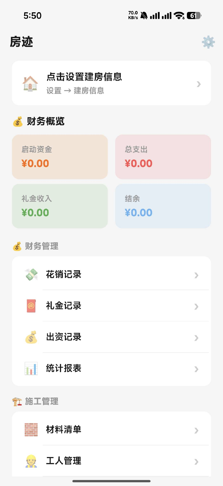
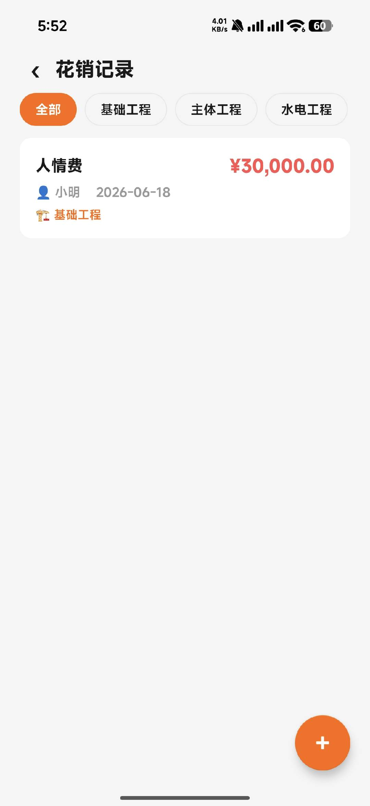
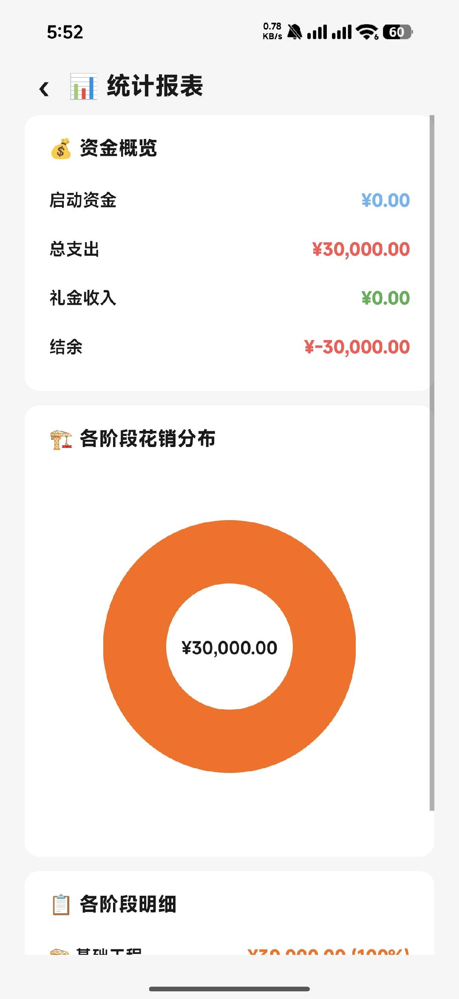
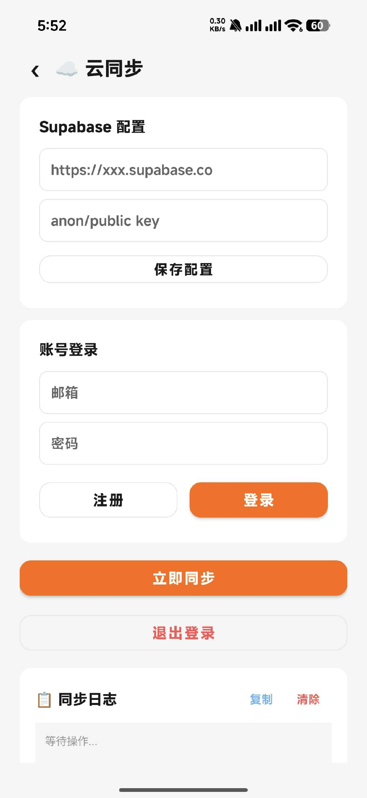

<div align="center">

# 🏠 房迹

**建房记账管理工具**

记录建房过程中的每一笔花销、材料、工人、施工日志

[](https://github.com/syydds18/fangji)
[](https://github.com/syydds18/fangji)
[](https://opensource.org/licenses/MIT)

</div>

---

## ✨ 功能特色

<table>
<tr>
<td width="50%">

### 📊 财务管理
- 💰 花销记录（分类、日期、金额、备注）
- 🎁 礼金收入管理
- 💵 出资记录（多方出资来源）
- 📈 统计报表（按类别、时间分析）

</td>
<td width="50%">

### 🧱 施工记录
- 🧱 材料清单（待购/已购/已到货）
- 👷 工人管理
- 📋 施工日志
- 🏗️ 里程碑/大事记

</td>
</tr>
<tr>
<td width="50%">

### 🏠 房屋信息
- 🖼️ 户型图管理
- 🚪 房间管理
- 📺 电器大件记录
- 🔧 维修记录

</td>
<td width="50%">

### ☁️ 数据管理
- ☁️ Supabase 云同步（多设备）
- 📤 数据导入/导出
- 🏪 供应商管理
- 📋 证件资料管理

</td>
</tr>
</table>

## 📱 截图

<div align="center">
<table>
<tr>
<td></td>
<td></td>
<td></td>
<td></td>
</tr>
<tr>
<td align="center">首页</td>
<td align="center">花销记录</td>
<td align="center">统计报表</td>
<td align="center">云同步</td>
</tr>
</table>
</div>

## 🚀 快速开始

### 安装
1. 从 [Releases](https://github.com/syydds18/fangji/releases) 下载最新 APK
2. 在 Android 设备上安装（需要允许未知来源应用）
3. 打开应用，开始记录

### 云同步配置（可选）
1. 注册 [Supabase](https://supabase.com) 账号
2. 创建项目，获取 URL 和 anon key
3. 在应用设置页面填入配置
4. 执行数据库建表 SQL（见下方）

<details>
<summary>📋 数据库建表 SQL</summary>

```sql
-- 支出记录
CREATE TABLE IF NOT EXISTS expenses (
    id BIGSERIAL PRIMARY KEY,
    category TEXT DEFAULT '',
    amount DOUBLE PRECISION DEFAULT 0,
    description TEXT DEFAULT '',
    supplier_id BIGINT DEFAULT 0,
    date BIGINT DEFAULT 0,
    note TEXT DEFAULT '',
    image_paths TEXT DEFAULT '',
    created_at BIGINT DEFAULT 0,
    user_id TEXT DEFAULT ''
);

-- 礼金记录
CREATE TABLE IF NOT EXISTS gift_money (
    id BIGSERIAL PRIMARY KEY,
    giver_name TEXT DEFAULT '',
    relationship TEXT DEFAULT '',
    amount DOUBLE PRECISION DEFAULT 0,
    occasion TEXT DEFAULT '',
    date BIGINT DEFAULT 0,
    note TEXT DEFAULT '',
    created_at BIGINT DEFAULT 0,
    user_id TEXT DEFAULT ''
);

-- 材料清单
CREATE TABLE IF NOT EXISTS materials (
    id BIGSERIAL PRIMARY KEY,
    name TEXT DEFAULT '',
    category TEXT DEFAULT '',
    brand TEXT DEFAULT '',
    spec TEXT DEFAULT '',
    unit TEXT DEFAULT '',
    budget_price DOUBLE PRECISION DEFAULT 0,
    actual_price DOUBLE PRECISION DEFAULT 0,
    quantity DOUBLE PRECISION DEFAULT 0,
    status TEXT DEFAULT 'pending',
    supplier_id BIGINT DEFAULT 0,
    note TEXT DEFAULT '',
    created_at BIGINT DEFAULT 0,
    user_id TEXT DEFAULT ''
);

-- 工人管理
CREATE TABLE IF NOT EXISTS workers (
    id BIGSERIAL PRIMARY KEY,
    name TEXT DEFAULT '',
    phone TEXT DEFAULT '',
    skill TEXT DEFAULT '',
    daily_wage DOUBLE PRECISION DEFAULT 0,
    work_days INT DEFAULT 0,
    total_paid DOUBLE PRECISION DEFAULT 0,
    note TEXT DEFAULT '',
    created_at BIGINT DEFAULT 0,
    user_id TEXT DEFAULT ''
);

-- 出资记录
CREATE TABLE IF NOT EXISTS funding_sources (
    id BIGSERIAL PRIMARY KEY,
    contributor_name TEXT DEFAULT '',
    relationship TEXT DEFAULT '',
    amount DOUBLE PRECISION DEFAULT 0,
    date BIGINT DEFAULT 0,
    note TEXT DEFAULT '',
    created_at BIGINT DEFAULT 0,
    user_id TEXT DEFAULT ''
);

-- 里程碑
CREATE TABLE IF NOT EXISTS milestones (
    id BIGSERIAL PRIMARY KEY,
    title TEXT DEFAULT '',
    date BIGINT DEFAULT 0,
    description TEXT DEFAULT '',
    created_at BIGINT DEFAULT 0,
    user_id TEXT DEFAULT ''
);

-- 供应商
CREATE TABLE IF NOT EXISTS suppliers (
    id BIGSERIAL PRIMARY KEY,
    name TEXT DEFAULT '',
    phone TEXT DEFAULT '',
    address TEXT DEFAULT '',
    category TEXT DEFAULT '',
    note TEXT DEFAULT '',
    created_at BIGINT DEFAULT 0,
    user_id TEXT DEFAULT ''
);

-- 施工日志
CREATE TABLE IF NOT EXISTS daily_logs (
    id BIGSERIAL PRIMARY KEY,
    content TEXT DEFAULT '',
    weather TEXT DEFAULT '',
    date BIGINT DEFAULT 0,
    image_paths TEXT DEFAULT '',
    created_at BIGINT DEFAULT 0,
    user_id TEXT DEFAULT ''
);

-- 电器大件
CREATE TABLE IF NOT EXISTS appliances (
    id BIGSERIAL PRIMARY KEY,
    name TEXT DEFAULT '',
    brand TEXT DEFAULT '',
    model TEXT DEFAULT '',
    category TEXT DEFAULT '',
    purchase_channel TEXT DEFAULT '',
    purchase_date BIGINT DEFAULT 0,
    price DOUBLE PRECISION DEFAULT 0,
    warranty_years INT DEFAULT 0,
    warranty_expire_date BIGINT DEFAULT 0,
    install_date BIGINT DEFAULT 0,
    after_sale_phone TEXT DEFAULT '',
    serial_number TEXT DEFAULT '',
    note TEXT DEFAULT '',
    image_paths TEXT DEFAULT '',
    created_at BIGINT DEFAULT 0,
    user_id TEXT DEFAULT ''
);

-- 项目配置
CREATE TABLE IF NOT EXISTS project_config (
    key TEXT PRIMARY KEY,
    value TEXT DEFAULT '',
    user_id TEXT DEFAULT ''
);

-- 为所有表开启 RLS
ALTER TABLE expenses ENABLE ROW LEVEL SECURITY;
ALTER TABLE gift_money ENABLE ROW LEVEL SECURITY;
ALTER TABLE materials ENABLE ROW LEVEL SECURITY;
ALTER TABLE workers ENABLE ROW LEVEL SECURITY;
ALTER TABLE funding_sources ENABLE ROW LEVEL SECURITY;
ALTER TABLE milestones ENABLE ROW LEVEL SECURITY;
ALTER TABLE suppliers ENABLE ROW LEVEL SECURITY;
ALTER TABLE daily_logs ENABLE ROW LEVEL SECURITY;
ALTER TABLE appliances ENABLE ROW LEVEL SECURITY;
ALTER TABLE project_config ENABLE ROW LEVEL SECURITY;

-- 创建 RLS 策略（用户只能操作自己的数据）
CREATE POLICY "Users can manage own expenses" ON expenses FOR ALL
    USING (auth.uid()::text = user_id) WITH CHECK (auth.uid()::text = user_id);
CREATE POLICY "Users can manage own gift_money" ON gift_money FOR ALL
    USING (auth.uid()::text = user_id) WITH CHECK (auth.uid()::text = user_id);
CREATE POLICY "Users can manage own materials" ON materials FOR ALL
    USING (auth.uid()::text = user_id) WITH CHECK (auth.uid()::text = user_id);
CREATE POLICY "Users can manage own workers" ON workers FOR ALL
    USING (auth.uid()::text = user_id) WITH CHECK (auth.uid()::text = user_id);
CREATE POLICY "Users can manage own funding_sources" ON funding_sources FOR ALL
    USING (auth.uid()::text = user_id) WITH CHECK (auth.uid()::text = user_id);
CREATE POLICY "Users can manage own milestones" ON milestones FOR ALL
    USING (auth.uid()::text = user_id) WITH CHECK (auth.uid()::text = user_id);
CREATE POLICY "Users can manage own suppliers" ON suppliers FOR ALL
    USING (auth.uid()::text = user_id) WITH CHECK (auth.uid()::text = user_id);
CREATE POLICY "Users can manage own daily_logs" ON daily_logs FOR ALL
    USING (auth.uid()::text = user_id) WITH CHECK (auth.uid()::text = user_id);
CREATE POLICY "Users can manage own appliances" ON appliances FOR ALL
    USING (auth.uid()::text = user_id) WITH CHECK (auth.uid()::text = user_id);
CREATE POLICY "Users can manage own project_config" ON project_config FOR ALL
    USING (auth.uid()::text = user_id) WITH CHECK (auth.uid()::text = user_id);
```

</details>

## 🛠️ 技术栈

| 技术 | 说明 |
|------|------|
| **Kotlin** | 主要开发语言 |
| **Room** | 本地数据库 |
| **Supabase** | 云端同步（PostgreSQL + REST API） |
| **Material Design** | UI 设计规范 |
| **Coroutines** | 异步处理 |
| **OkHttp + Retrofit** | 网络请求 |

## 📁 项目结构

```
app/src/main/java/com/construction/diary/cloud/
├── cloud/              # Supabase 同步逻辑
├── data/
│   ├── dao/            # Room DAO
│   ├── entity/         # 数据实体
│   └── AppDatabase.kt  # 数据库定义
└── ui/
    ├── about/          # 关于页面
    ├── cloud/          # 云同步页面
    ├── dailylog/       # 施工日志
    ├── export/         # 数据导入导出
    ├── expense/        # 花销记录
    ├── funding/        # 出资记录
    ├── gift/           # 礼金记录
    ├── maintenance/    # 维修记录
    ├── material/       # 材料清单
    ├── milestone/      # 里程碑
    ├── room/           # 房间管理
    ├── settings/       # 设置
    ├── stats/          # 统计报表
    ├── supplier/       # 供应商
    └── worker/         # 工人管理
```

## 📄 开源协议

本项目基于 [MIT License](LICENSE) 开源，**仅供个人学习和非商业用途使用**。

未经授权，禁止将本项目用于商业目的。

## 📧 联系开发者

- 邮箱：syydds@vip.qq.com

## ⭐ Star History

如果这个项目对你有帮助，请给个 Star ⭐ 支持一下！

---

<div align="center">

**用 ❤️ 为建房人打造**

</div>
